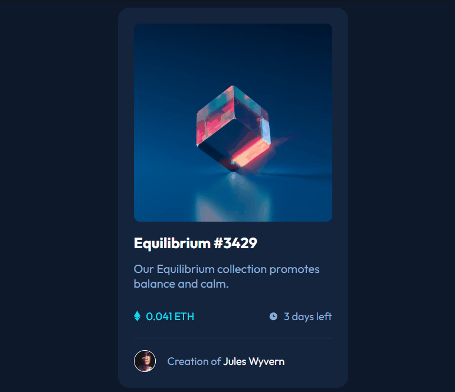

# Frontend Mentor - NFT preview card component solution

This is a solution to the [NFT preview card component challenge on Frontend Mentor](https://www.frontendmentor.io/challenges/nft-preview-card-component-SbdUL_w0U). Frontend Mentor challenges help you improve your coding skills by building realistic projects. 

## Table of contents

- [Overview](#overview)
  - [The challenge](#the-challenge)
  - [Screenshot](#screenshot)
  - [Links](#links)
- [My process](#my-process)
  - [Built with](#built-with)
  - [What I learned](#what-i-learned)
  - [Continued development](#continued-development)
- [Author](#author)
- [Acknowledgments](#acknowledgments)

## Overview

### The challenge

Users should be able to:

- View the optimal layout depending on their device's screen size
- See hover states for interactive elements

### Screenshot

### Links

- Solution URL: [Add solution URL here](https://your-solution-url.com)
- Live Site URL: [Add live site URL here](https://your-live-site-url.com)

## My process

### Built with

- Semantic HTML5 markup
- CSS custom properties
- Flexbox

### What I learned

Durante a realização do desafio, consegui aprofundar meu conhecimento sobre as pseudo classes e os pseudo elementos do CSS. Descobri como usá-los para criar uma página mais interativa.

During the challenge, I was able to deepen my knowledge about CSS pseudo classes and pseudo elements. I figured out how to use them to create a more interactive page.

### Continued development

Espero desenvolver minhas habilidades com as pseudo classes e pseudo elementos em meus futuros projetos.

I hope to develop my skills with pseudo classes and pseudo elements in my future projects.

## Author
- Frontend Mentor - [@DiegoF824](https://www.frontendmentor.io/profile/DiegoF824)

## Acknowledgments

- [Dev em Dobro](https://www.youtube.com/@DevemDobro) 
